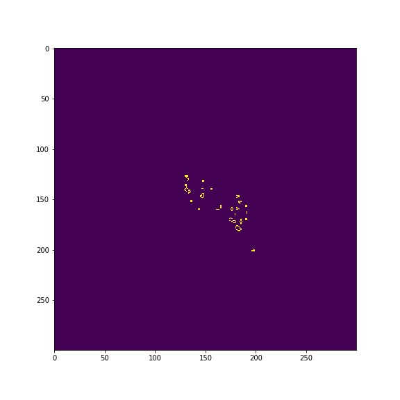

# Game-of-Life
## John Conway's Game of Life
In this repo I have provided python code for simulating game of life using different patterns. Detailed discussion has been provided in the code. 
## Some results
### Glider

### Beacon

### Gosper Glider Gun

### Pulsar

### Block Switch Engine

### R-Pentomino

